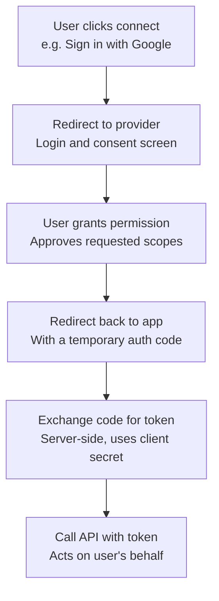

# Module 7: Auth Types — API Key vs Bearer Token vs OAuth

## Concept

Three common ways APIs verify who's calling:

### 1. API Key
A single static string, often passed as a query param or header (e.g. ?api_key=abc123 or X-API-Key: abc123). Simple but less secure — visible in URLs/logs, doesn't expire on its own. Usually identifies which app/account is calling, not a specific end user.

### 2. Bearer Token
Passed as Authorization: Bearer <token> — used in Module 6 with Stripe. "Bearer" means whoever holds the token is trusted, no further proof needed. Often paired with expiry (short-lived, refreshable) — more secure than a permanent API key. In Stripe's case, the same key both identifies the account and authorizes the action, since it's account-to-account, not per-end-user.

### 3. OAuth 2.0
Multi-step handshake, familiar as "Sign in with Google" / "Connect your Slack account." The user logs into the actual service, grants specific scoped permissions (e.g. read calendar but not send email), and the requesting app receives a token to act on that user's behalf. More complex to implement, but required when a product needs to act as a specific individual user with limited, revocable permissions.

Key security property: the requesting app never sees the user's actual password — only a scoped, revocable token issued after explicit user consent.

## OAuth 2.0 flow (diagram)

Gray/start = the trigger. Steps 2-4 = the redirect/consent handshake, happening in the browser directly with the provider's servers. Steps 5-6 = server-to-server only, using a private client secret the app holds.

## Test: correct key, wrong format

Sent the valid Stripe key, but as a raw API Key header instead of Bearer format (no "Bearer" prefix).

Request: GET https://api.stripe.com/v1/customers
Header: Authorization: sk_test_... (raw key, no Bearer prefix)

Status: 401 Unauthorized
Response:
{
  "error": {
    "message": "You did not provide an API key. You need to provide your API key in the Authorization header, using Bearer auth (e.g. 'Authorization: Bearer YOUR_SECRET_KEY').",
    "type": "invalid_request_error"
  }
}

This is the exact same error as sending no key at all (Module 6). Stripe doesn't attempt to parse a malformed auth header — a correctly-valued key in the wrong format is treated identically to a missing key.

## Why this matters for PM work

Recognizing which auth model a third-party API uses directly affects: engineering effort to integrate, security review scope, and whether end-user consent screens are needed. It also matters operationally — when an integration fails auth, "check the exact header format the docs specify" is often the real fix, not "the credential itself must be wrong." Format precision matters as much as the value.

## Key takeaway

> API Key = simplest, account-level, less secure. Bearer Token = account or session-level, often expiring, moderate security, no user consent step. OAuth = user-level, scoped, most secure, most implementation effort — required whenever a product acts on behalf of an individual user in a third-party system, and the only one of the three where the app never touches the user's actual password.
